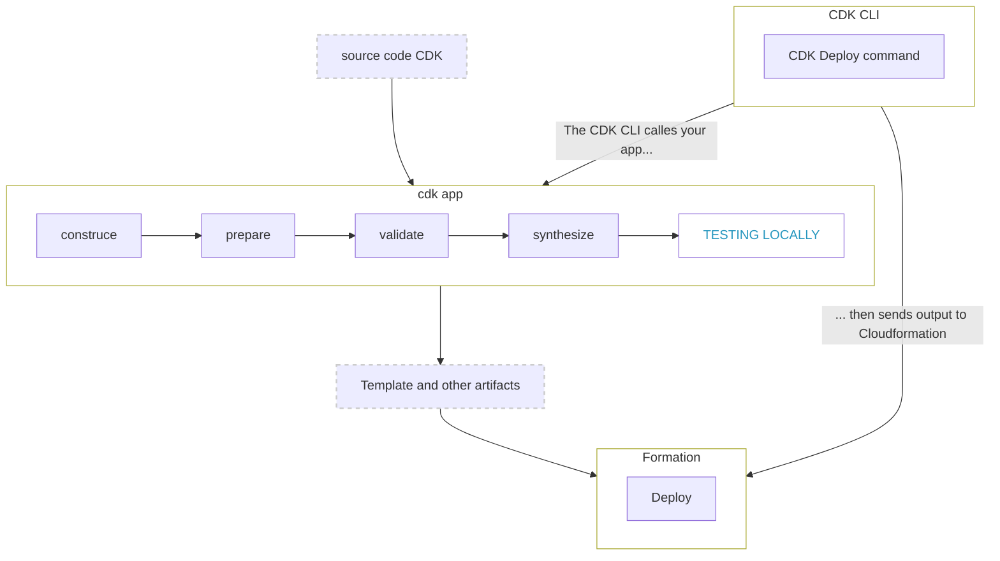
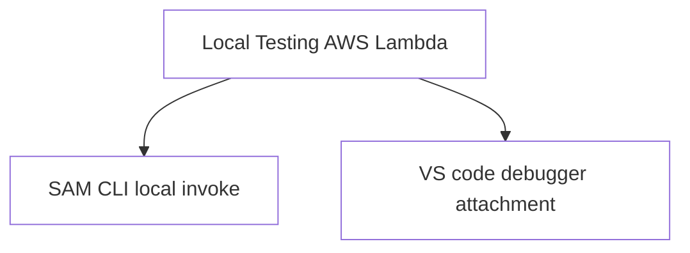
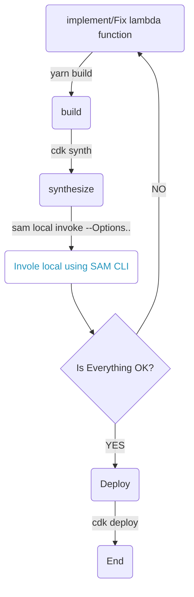

# Testing Serverless Applications

|      **Version  1.0**       |

`AWS SAM` and `AWS CDK` are both open-source frameworks for building applications using infrastructure as code (IaC). AWS SAM is template-based using JSON or YAML, while the AWS CDK uses languages such as Python or Node.

## Prerequisites

-   [Docker](https://www.docker.com/)
- [Install AWS CLI](https://docs.aws.amazon.com/cli/latest/userguide/getting-started-install.html)
- Configure AWS profile with permissions to deploy architecture 
- [Install Sam CLI](https://docs.aws.amazon.com/serverless-application-model/latest/developerguide/serverless-sam-cli-install.html)
- [Install AWS CDK](https://docs.aws.amazon.com/cdk/v2/guide/getting_started.html)
- [AWS Toolkit for Visual Studio Code](https://aws.amazon.com/visualstudiocode/)

> make sure installed above requirement installed correctly.

## AWS-CDK Implementation life cycle



`AWS CDK` has a few commands to deploy the lambda function and test in an AWS lambda environment. 

But If we need to do some small changes or fix some issues that we have done in the code, we have to redeploy. It's not an efficient way to develop in a tightly scheduled environment. It may take some unacceptable time to deploy the CDK application again. 

With the `AWS SAM command line interface (CLI)`, you can locally test and "step-through" debug your serverless applications before uploading your application to the AWS Cloud. You can verify whether your application is behaving as expected, debug what's wrong, and fix any issues, before going through the steps of packaging and deploying your application.

> Here only consider about `Local Testing` lambda function.

## AWS-CDK Application Lambda function Local Testing



let's consider below sample lambda function local testing that is written in [Typescript](https://www.typescriptlang.org/)

```js
import { APIGatewayEvent } from 'aws-lambda';
import { DynamoDB } from 'aws-sdk';
import {v1} from 'uuid';

exports.handler = async function (event: APIGatewayEvent) {
    try {
        console.log("====> REQUEST: ", JSON.stringify(event));
        if(!process.env.BOOK_TABLE){
            throw new Error();
        }
        const dynamoDb = new DynamoDB.DocumentClient();
        const body = JSON.parse(event?.body ?? 'null');
        if(!body){
            throw new Error();
        }
        const { title, author, yearPublish } = body;

        await dynamoDb.put({
            TableName: process.env.BOOK_TABLE,
            Item: {
                id: v1(),
                title,
                author,
                yearPublish
            }
        }).promise();

        return {
            statusCode: 200,
            body: JSON.stringify({
                message: 'Success'
            })
        };
        
    } catch (error) {
        return {
            statusCode: 400,
            body: JSON.stringify({
                error
            })
        }
    }
}
```

### Using SAM CLI

<!-- Here is an folder structer in `AWS-CDK` application -->

<!--  -->

<!-- Normally we write all the lambda function inside the `lib` folder. -->

there are a few commands to deploy `AWS-CDK` Application.

```sh
$ yarn build
$ cdk synth
$ cdk deploy
```
About lambda function testing without deployment, don't need to use `cdk deploy` command till finished all the lambda local testing.  



### [Invoke CDK lambda function locally Using SAM-CLI](https://docs.aws.amazon.com/serverless-application-model/latest/developerguide/serverless-sam-cli-using-invoke.html)

> Need to run `yarn build` and `cdk synth` every time when we done any changes in the lambda function.

AWS Lambda getting different payloads from different event sources, such as Amazon S3, Amazon API Gateway, and Amazon SNS, first need to identify from where invoke lambda function.

In `SAM-CLI` have an event generate feature to generate sample payloads for different event resources. use this [link](https://docs.aws.amazon.com/serverless-application-model/latest/developerguide/sam-cli-command-reference-sam-local-generate-event.html) for official documentation.

> For example, let's consider the above lambda function invoke source is **ApiGateway**.

**`Generating Sample Event`**

```sh
$ sam local generate-event apigateway aws-proxy --method GET
```

**`Diffectly save to json file`**
```sh
$ sam local generate-event apigateway aws-proxy --method GET > ./event/sample-event.json
```
This will save generated event directly to a JSON file.
> Note: SAM applicaiton all the events keep in event directory in root.

**`Environment variable`**

Create a JSON file that contains the environment variables to override.

To declare environment variables that apply globally to all resources, specify a Parameters object like the following:

```json
{
    "Parameters": {
        "TABLE_NAME": "localtable",
        "BUCKET_NAME": "testBucket",
        "STAGE": "dev"
    }
}
```

To declare different environment variables for each resource, specify objects for each resource like the following:

```json
{
    "MyFunction1": {
        "TABLE_NAME": "localtable",
        "BUCKET_NAME": "testBucket",
    },
    "MyFunction2": {
        "TABLE_NAME": "localtable",
        "STAGE": "dev"
    }
}
```

To override environment variables with those defined in your JSON file, use the --env-vars argument with the **invoke** command

```sh
$ sam local invoke --env-vars env.json
```

**`Invoke Lambda function Locally`**

You can invoke your AWS Lambda function locally by using the [sam local invoke](https://docs.aws.amazon.com/serverless-application-model/latest/developerguide/sam-cli-command-reference-sam-local-invoke.html) AWS SAM CLI command and providing the function's logical ID and an event file. Alternatively, sam local invoke also accepts stdin as an event. For more information about events, see [Event](https://docs.aws.amazon.com/lambda/latest/dg/gettingstarted-concepts.html#gettingstarted-concepts-event) in the AWS Lambda Developer Guide. For information about event message formats from different AWS services, see [Using AWS Lambda with other services](https://docs.aws.amazon.com/lambda/latest/dg/lambda-services.html) in the AWS Lambda Developer Guide.

```sh
# Invoking function with event file
$ sam local invoke -t ./cdk.out/template.json -e event.json --env-vars env.json

# sam local invoke -t [template file] -e [payload json] --env-vars [Environment variable] [lambda function]

# For more options
$ sam local invoke --help
```
> CDK application template file create as JSON file, when invoke lambda function need to pass template file as template argument.

Then you can see SAM CLI create lambda environment on docker and mount all the file into docker.

below is an exmple for local invoke lambda function logs.

```sh
Invoking index.handler (nodejs14.x)
Skip pulling image and use local one: public.ecr.aws/sam/emulation-nodejs14.x:rapid-1.53.0-x86_64.

Mounting /Users/gayanmadurapperuma/Documents/My_work/AWS/sam-cdk/cdk.out/asset.6fdc1e42fb1e0f23bcdd6c304a4c215a34583db8c18c0b930419ce32ecb50431 as /var/task:ro,delegated inside runtime container
START RequestId: e4309037-96fc-4a12-a2a9-1de3c3831d32 Version: $LATEST
END RequestId: e4309037-96fc-4a12-a2a9-1de3c3831d32
REPORT RequestId: e4309037-96fc-4a12-a2a9-1de3c3831d32	Init Duration: 0.90 ms	Duration: 3690.04 ms	Billed Duration: 3691 ms	Memory Size: 128 MB	Max Memory Used: 128 MB
{"statusCode":200,"body":"{\"message\":\"Success\"}"}%
```

using terminal logs we can identify issues on lambda function before deploy uisng sam local invoke. 

### [VS code debugger attachment](https://docs.aws.amazon.com/serverless-application-model/latest/developerguide/serverless-sam-cli-install.html)

1. First Install [AWS Toolkit for VS Code](https://marketplace.visualstudio.com/items?itemName=AmazonWebServices.aws-toolkit-vscode)
2. Create `launch.json` file.
    - Navigate **RUN AND DEBUG**
    - Click **Create a launch.json file**
    - Select **AWS SAM: Debug Lambda Function Locally**

Then you can see create a `launch.json` file with multiple configurations, here is a simplified example

```json
{
"version": "0.2.0",
    "configurations": [
        // example for file-system to locate the lambdaHandler
        {
            "type": "aws-sam",
            "request": "direct-invoke",
            "name": "AWS-CDK-SAM",
            "invokeTarget": {
                "target": "code",
                "projectRoot": "lib/books/lambda/create",
                "lambdaHandler": "index.handler"
            },
            "lambda": {
                "runtime": "nodejs14.x",
                "timeoutSec": 10, // optional
                "payload": {
                    "json": {}
                },
                "environmentVariables": {
                }
            }
        },
        // example for Path to the CFN/SAM template
        {
            "type": "aws-sam",
            "request": "direct-invoke",
            "name": "bootstrap:StagingBucket",
            "invokeTarget": {
                "target": "template",
                "templatePath": "${workspaceFolder}/node_modules/aws-cdk/lib/api/bootstrap/bootstrap-template.yaml",
                "logicalId": "StagingBucket"
            },
            "lambda": {
                "payload": {},
                "environmentVariables": {}
            }
        }
    ]
}
```
when need to debug a specific lambda function, need to change some values in the above JSON that contain debug values for the target function. 

**`Launch.JSON Properties`**

1. ***`invokeTarget:`*** Template Target Properties
    - **target:** The type of invocation to launch. Possible values:
      * `template` uses a CFN/SAM Template as an entrypoint
      * `code` invokes Lambda code directly.
      * `api` uses the CFN/SAM Template to emulate API Gateway
    - **templatePath:** Path to the CFN/SAM template.
    - **projectRoot:** The root of the project, used to determine where in the file-system to locate the lambdaHandler.
    - **logicalId:** Resource name of an AWS::Lambda::Function or AWS::Serverless::Function to invoke.
    - **lambdaHandler:** Lambda Function handler to invoke.
2. ***`lambda:`*** Lambda Properties, Lambda specific details of the invocation 
   - **runtime:** The Lambda function's runtime
   - **timeoutSec:** The amount of time (in seconds) that Lambda allows a function to run before stopping it.
   - **payload:** Event payload to pass to the Lambda invocation. Must specify one of 'json' or 'path'.
   - **environmentVariables:** Environment variables to pass to the function invocation (replaces template variables).

**`Run Debbger`**

1. Put some break point that same lambda function configured `launch.json` file.
2. Navigate **RUN AND DEBUG**
3. Click **Start Debugging**
4. Then we can debug specific lambda functions as normal Node, express service debugs in VS code.

## Conclusion

With AWS SAM CLI native support for AWS CDK. In this post, I show how to use the AWS SAM CLI to test locally and develop serverless applications seamlessly within an AWS CDK project. No longer is the AWS SAM CLI just for AWS SAM; instead, AWS SAM and AWS CDK are better together.

|      **Written by Gayan Madurapperuma**       |

