## Otterz Dtabase Structure

> As a database otterz using [DynamoDB](https://aws.amazon.com/dynamodb/)

### List of all the database using Otterz

- application
- master-settings-table
- otterz-cards
- otterz-generalInfo
- Authentication
- ExternalNotifications
- Rbac
- Tenant
- pa-settings
- payment-acceptance-onbarad-admin
- payment-acceptance-onboard
- payment
- product
- rewardsTable
- Subscription
- SubscriptionPlan
- SubscriptionUser
- tax
- temp__disable_nitificaitons
- tenantInfoForUnitEvents

## Database Structure and Access Pattern

<strong>Application Table</strong>

Structure of `Application` table.

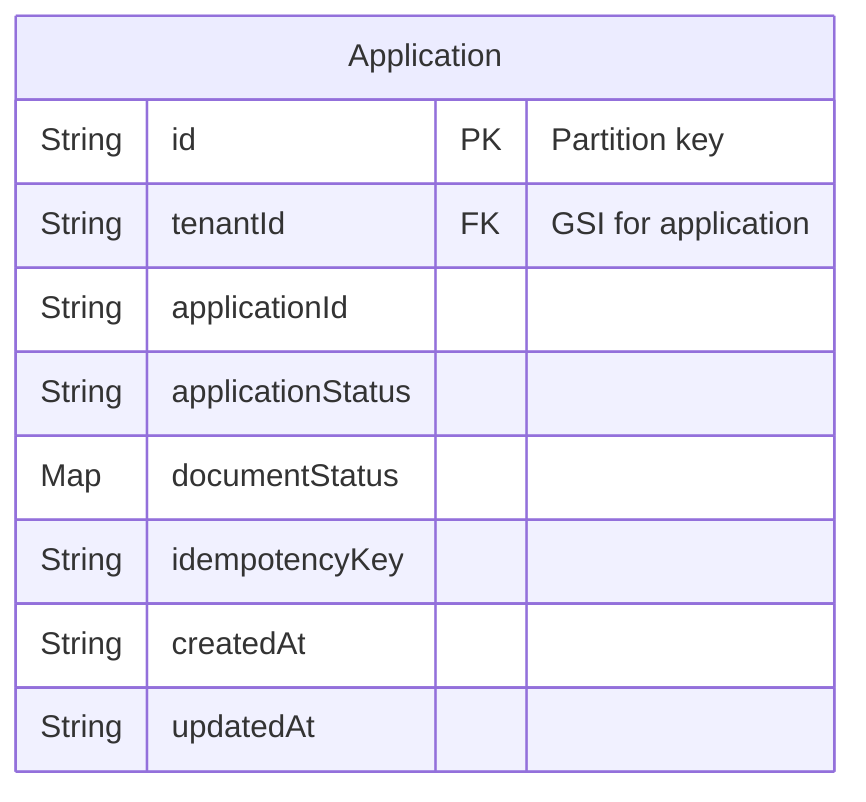
```mermaid
erDiagram
Application {
    String id PK "Partition key"
    String tenantId FK "GSI for application"
    String applicationId
    String applicationStatus
    Map documentStatus
    String idempotencyKey
    String createdAt
    String updatedAt
}

```

Access pattern `Applicaiton`

| Table Name | Access Pattern |
| ---------- | -------------- |
| Application |  GetApplicationByTenantId | 

Global secondary indexes `Application`

| Name | partition key | sortKey |
| ---------- | -------------- | ----------- |
| GetApplicationByTenantId | tenantId (String) |  |

<strong>otterz-generalInfo Table</strong>

Structure of `otterz-generalInfo` table.

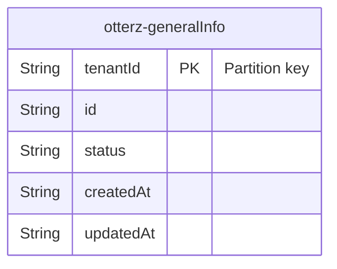
```mermaid
erDiagram
otterz-generalInfo {
    String tenantId PK "Partition key"
    String id
    String status
    String createdAt
    String updatedAt
}

```

<strong>Authentication Table</strong>

Structure of `Authentication` table

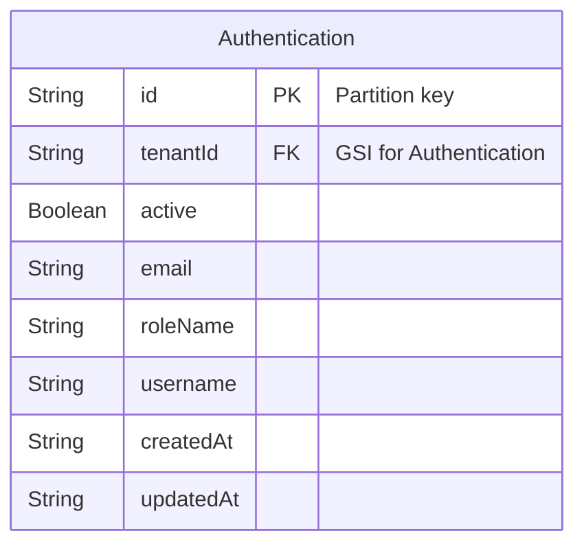
```mermaid
erDiagram
Authentication {
    String id PK "Partition key"
    String tenantId FK "GSI for Authentication"
    Boolean active
    String email
    String roleName
    String username
    String createdAt
    String updatedAt
}
```

Access pattern `Authentication`

| Table Name | Access Pattern |
| ---------- | -------------- |
| Authentication |  GetChildUsersByTenantId | 

Global secondary indexes `Authentication`

| Name | partition key | sortKey |
| ---------- | -------------- | ----------- |
| GetChildUsersByTenantId | tenantId (String) |  |

<strong>ExternalNotifications Table</strong>

Structure of `ExternalNotifications` table

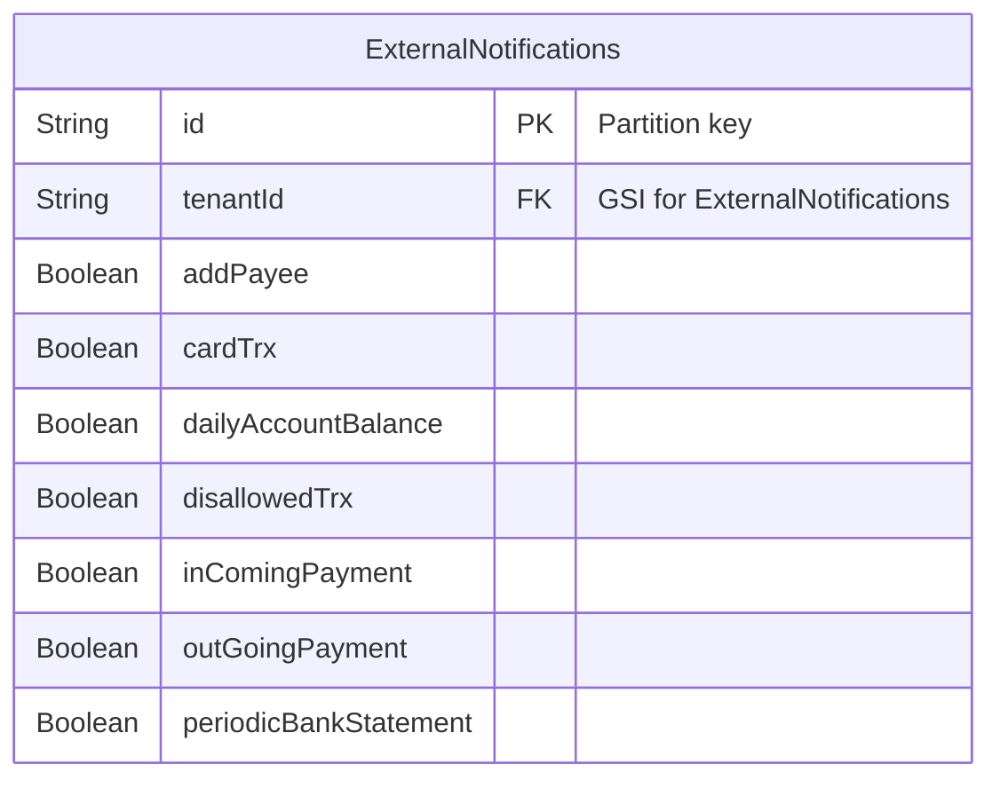
```mermaid
erDiagram
ExternalNotifications {
    String id PK "Partition key"
    String tenantId FK "GSI for ExternalNotifications"
    Boolean addPayee
    Boolean cardTrx
    Boolean dailyAccountBalance
    Boolean disallowedTrx
    Boolean inComingPayment
    Boolean outGoingPayment
    Boolean periodicBankStatement
}
```

Access pattern `ExternalNotifications`

| Table Name | Access Pattern |
| ---------- | -------------- |
| ExternalNotifications |  NotificationSettingsByTenantId | 

Global secondary indexes `ExternalNotifications`

| Name | partition key | sortKey |
| ---------- | -------------- | ----------- |
| NotificationSettingsByTenantId | tenantId (String) |  |

<strong>Rbac Table</strong>

Structure of `Rbac` table

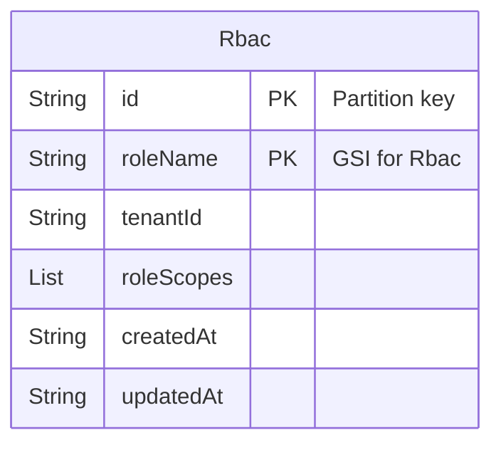
```mermaid
erDiagram
Rbac {
    String id PK "Partition key"
    String roleName PK "GSI for Rbac"
    String tenantId
    List roleScopes
    String createdAt
    String updatedAt
}
```

Access pattern `Rbac`

| Table Name | Access Pattern |
| ---------- | -------------- |
| Rbac |  listByRoleName | 

Global secondary indexes `Rbac`

| Name | partition key | sortKey |
| ---------- | -------------- | ----------- |
| listByRoleName | roleName (String) |  |

<strong>Tenant Table</strong>

Structure of `Tenant` table

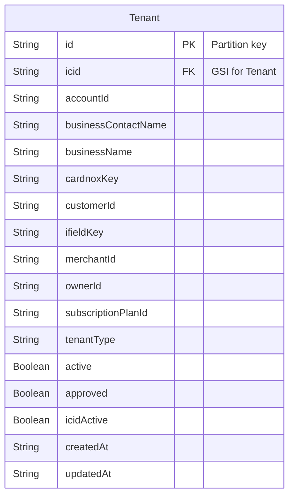
```mermaid
erDiagram
Tenant {
    String id PK "Partition key"
    String icid FK "GSI for Tenant"
    String accountId
    String businessContactName
    String businessName
    String cardnoxKey
    String customerId
    String ifieldKey
    String merchantId
    String ownerId
    String subscriptionPlanId
    String tenantType
    Boolean active
    Boolean approved
    Boolean icidActive
    String createdAt
    String updatedAt
}

```

Access pattern `Tenant`

| Table Name | Access Pattern |
| ---------- | -------------- |
| Tenant |  GetIfieldKeyByCompanyId | 

Global secondary indexes `Tenant`

| Name | partition key | sortKey |
| ---------- | -------------- | ----------- |
| GetIfieldKeyByCompanyId | icid (String) |  |

<strong>pa-settings Table</strong>

Structure of `pa-settings` table

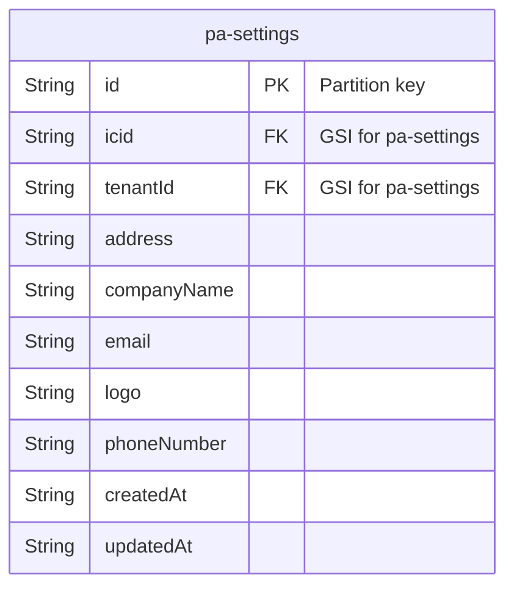
```mermaid
erDiagram
pa-settings {
    String id PK "Partition key"
    String icid FK "GSI for pa-settings"
    String tenantId FK "GSI for pa-settings"
    String address
    String companyName
    String email
    String logo
    String phoneNumber
    String createdAt
    String updatedAt
}
```

Access pattern `pa-settings`

| Table Name | Access Pattern |
| ---------- | -------------- |
| pa-settings |  GetPaymentAcceptanceSettingsByCompanyId |
| pa-settings |  GetPaymentAcceptanceSettingsByTenantId |

Global secondary indexes `pa-settings`

| Name | partition key | sortKey |
| ---------- | -------------- | ----------- |
| GetPaymentAcceptanceSettingsByCompanyId | icid (String) |  |
| GetPaymentAcceptanceSettingsByTenantId | tenantId (String) |  |

<strong>payment-acceptance-onbarad-admin Table</strong>

Structure of `payment-acceptance-onbarad-admin` table

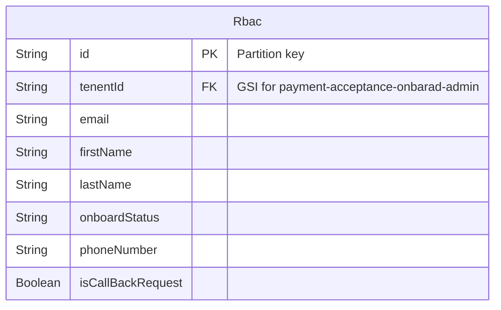
```mermaid
erDiagram
Rbac {
    String id PK "Partition key"
    String tenentId FK "GSI for payment-acceptance-onbarad-admin"
    String email
    String firstName
    String lastName
    String onboardStatus
    String phoneNumber
    Boolean isCallBackRequest
}
```

Access pattern `payment-acceptance-onbarad-admin`

| Table Name | Access Pattern |
| ---------- | -------------- |
| payment-acceptance-onbarad-admin |  getPaymentAcceptanceOnboardByTenentId |

Global secondary indexes `payment-acceptance-onbarad-admin`

| Name | partition key | sortKey |
| ---------- | -------------- | ----------- |
| getPaymentAcceptanceOnboardByTenentId | tenantId (String) |  |

<strong>payment-acceptance-onboard Table</strong>

Structure of `payment-acceptance-onboard` table

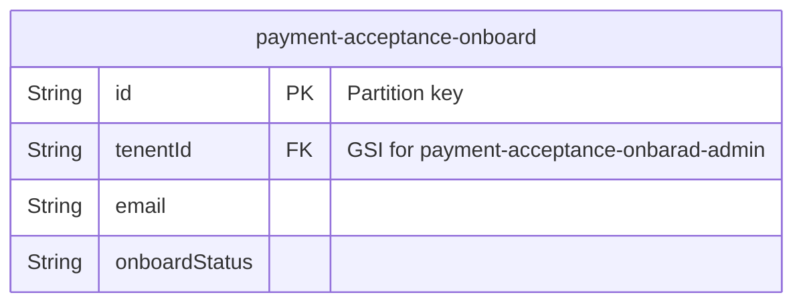
```mermaid
erDiagram
payment-acceptance-onboard {
    String id PK "Partition key"
    String tenentId FK "GSI for payment-acceptance-onbarad-admin"
    String email
    String onboardStatus
}
```

Access pattern `payment-acceptance-onboard`

| Table Name | Access Pattern |
| ---------- | -------------- |
| payment-acceptance-onboard |  GetPaymentAcceptanceOnboardStatusByTenentId | 

Global secondary indexes `payment-acceptance-onboard`

| Name | partition key | sortKey |
| ---------- | -------------- | ----------- |
| GetPaymentAcceptanceOnboardStatusByTenentId | tenantId (String) |  |

<strong>payment Table</strong>

Structure of `payment` table

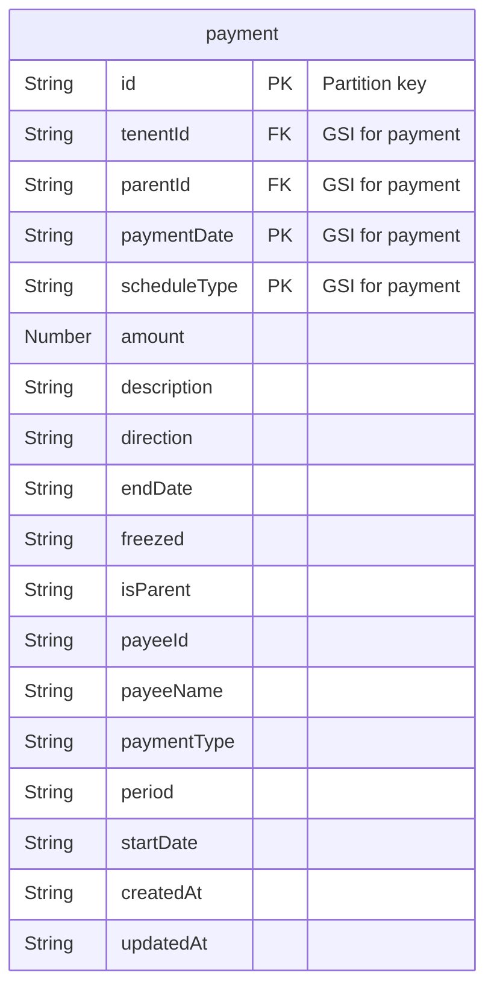
```mermaid
erDiagram
payment {
    String id PK "Partition key"
    String tenentId FK "GSI for payment"
    String parentId FK "GSI for payment"
    String paymentDate PK "GSI for payment"
    String scheduleType PK "GSI for payment"
    Number amount
    String description
    String direction
    String endDate
    String freezed
    String isParent
    String payeeId
    String payeeName
    String paymentType
    String period
    String startDate
    String createdAt
    String updatedAt
}
```
Access pattern `payment`

| Table Name | Access Pattern |
| ---------- | -------------- |
| payment |  getByParentTenantCombination | 
| payment |  getByRecurPaymentId | 
| payment |  getPaymentsByPayDate | 
| payment |  getPaymentsByTenantId | 
| payment |  getPaymentsByTenantIdAndType | 
| payment |  getRecurringParents | 

Global secondary indexes `payment`

| Name | partition key | sortKey |
| ---------- | -------------- | ----------- |
| getByParentTenantCombination | parentId (String) | tenantId (String) |
| getByRecurPaymentId | parentId (String) |  |
| getPaymentsByPayDate | paymentDate (String)	 |  |
| getPaymentsByTenantId | tenantId (String) | createdAt (String) |
| getPaymentsByTenantIdAndType | scheduleType (String)	 | tenantId (String) |
| getRecurringParents | scheduleType (String)	 | isParent (String) |

<strong>product Table</strong>

Structure of `product` table

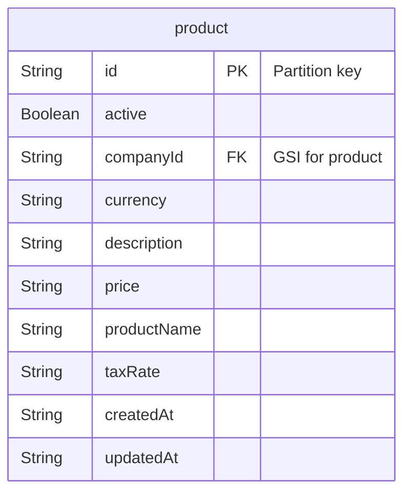
```mermaid
erDiagram
product {
    String id PK "Partition key"
    Boolean active
    String companyId FK "GSI for product"
    String currency
    String description
    String price
    String productName
    String taxRate
    String createdAt
    String updatedAt
}
```

Access pattern `product`

| Table Name | Access Pattern |
| ---------- | -------------- |
| product |  GetProductById | 

Global secondary indexes `payment`

| Name | partition key | sortKey |
| ---------- | -------------- | ----------- |
| GetProductById | companyId (String) |  |

<strong>rewardsTable Table</strong>

Structure of `rewardsTable` table

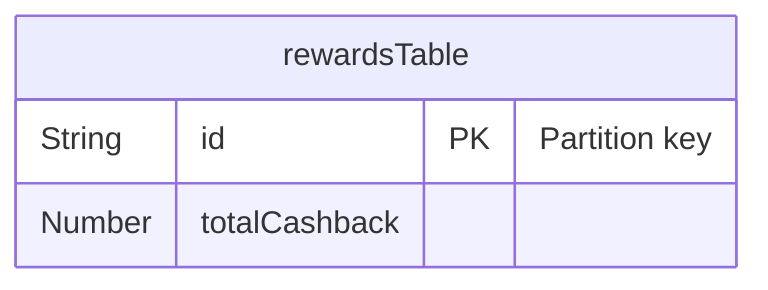
```mermaid
erDiagram
rewardsTable {
    String id PK "Partition key"
    Number totalCashback
}
```

<strong>Subscription Table</strong>

Structure of `Subscription` table

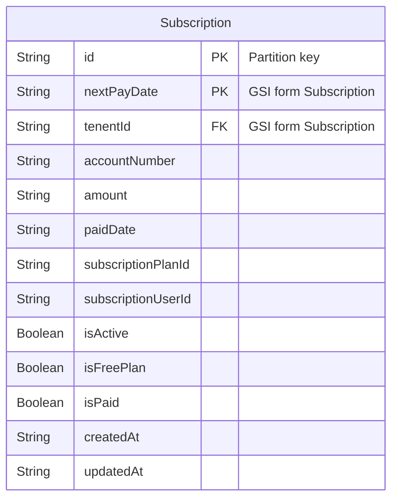
```mermaid
erDiagram
Subscription {
    String id PK "Partition key"
    String nextPayDate PK "GSI form Subscription"
    String tenentId FK "GSI form Subscription"
    String accountNumber
    String amount
    String paidDate
    String subscriptionPlanId
    String subscriptionUserId
    Boolean isActive
    Boolean isFreePlan
    Boolean isPaid
    String createdAt
    String updatedAt
}
```

Access pattern `Subscription`

| Table Name | Access Pattern |
| ---------- | -------------- |
| Subscription |  getSubscriptionsByPayDate |
| Subscription |  getSubscriptionsByTenentId | 

Global secondary indexes `Subscription`

| Name | partition key | sortKey |
| ---------- | -------------- | ----------- |
| getSubscriptionsByPayDate | nextPayDate (String) |  |
| getSubscriptionsByTenentId | tenentId (String) |  |

<strong>SubscriptionPlan Table</strong>

Structure of `SubscriptionPlan` table

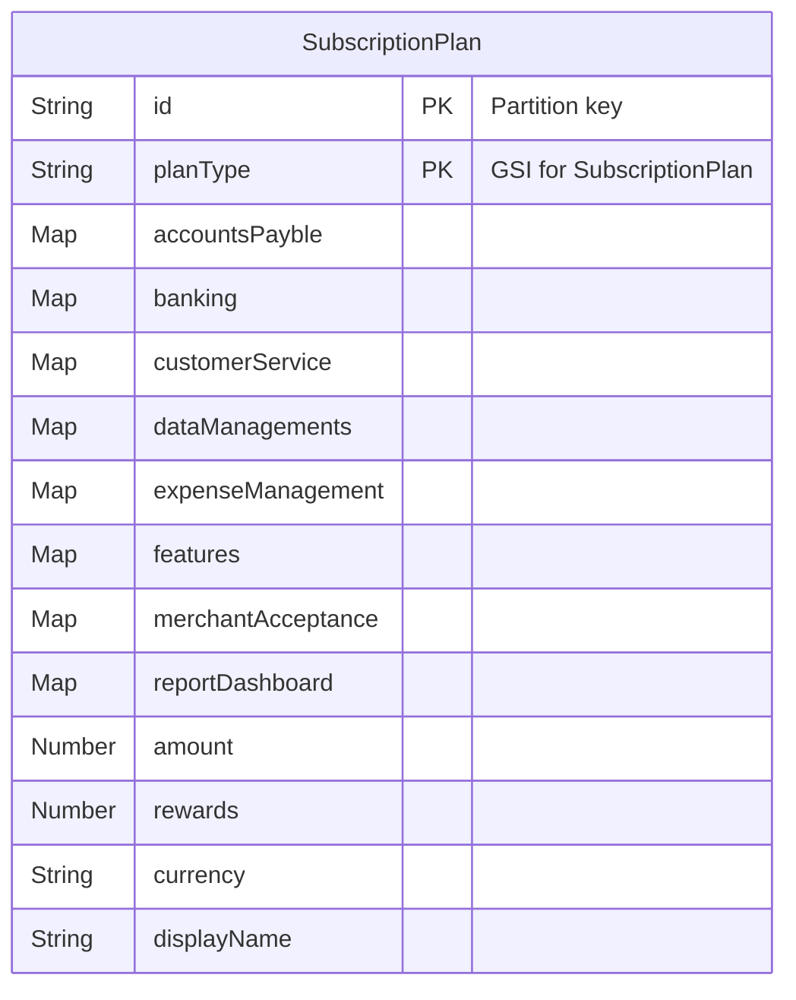
```mermaid
erDiagram
SubscriptionPlan {
    String id PK "Partition key"
    String planType PK "GSI for SubscriptionPlan"
    Map accountsPayble
    Map banking
    Map customerService
    Map dataManagements
    Map expenseManagement
    Map features
    Map merchantAcceptance
    Map reportDashboard
    Number amount
    Number rewards
    String currency
    String displayName
}
```

Access pattern `SubscriptionPlan`

| Table Name | Access Pattern |
| ---------- | -------------- |
| SubscriptionPlan |  GetBySubscriptionType |

Global secondary indexes `SubscriptionPlan`

| Name | partition key | sortKey |
| ---------- | -------------- | ----------- |
| GetBySubscriptionType | planType (String) |  |

<strong>SubscriptionUser Table</strong>

Structure of `SubscriptionUser` table

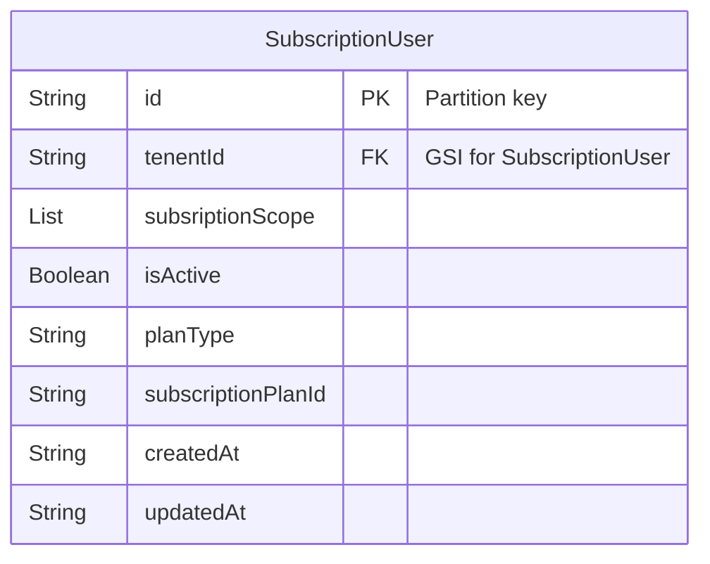
```mermaid
erDiagram
SubscriptionUser {
    String id PK "Partition key"
    String tenentId FK "GSI for SubscriptionUser"
    List subsriptionScope
    Boolean isActive
    String planType
    String subscriptionPlanId
    String createdAt
    String updatedAt
}
```

Access pattern `SubscriptionUser`

| Table Name | Access Pattern |
| ---------- | -------------- |
| SubscriptionUser |  getByTenentId |

Global secondary indexes `SubscriptionUser`

| Name | partition key | sortKey |
| ---------- | -------------- | ----------- |
| getByTenentId | tenentId (String) |  |

<strong>tax Table</strong>

Structure of `tax` table

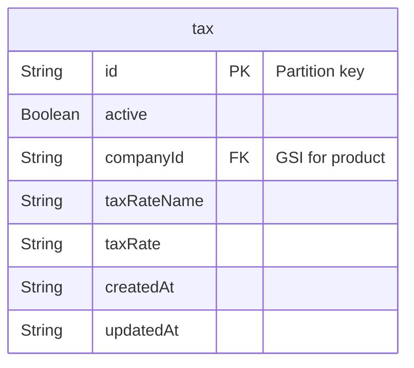
```mermaid
erDiagram
tax {
    String id PK "Partition key"
    Boolean active
    String companyId FK "GSI for product"
    String taxRateName
    String taxRate
    String createdAt
    String updatedAt
}
```

Access pattern `tax`

| Table Name | Access Pattern |
| ---------- | -------------- |
| tax |  GetTaxByCompanyId |

Global secondary indexes `tax`

| Name | partition key | sortKey |
| ---------- | -------------- | ----------- |
| GetTaxByCompanyId | companyId (String) |  |

<strong>temp__disable_nitificaitons Table</strong>

Structure of `temp__disable_nitificaitons` table

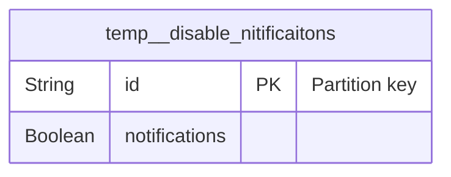
```mermaid
erDiagram
temp__disable_nitificaitons {
    String id PK "Partition key"
    Boolean notifications
}
```

<strong>tenantInfoForUnitEvents Table</strong>

Structure of `tenantInfoForUnitEvents` table

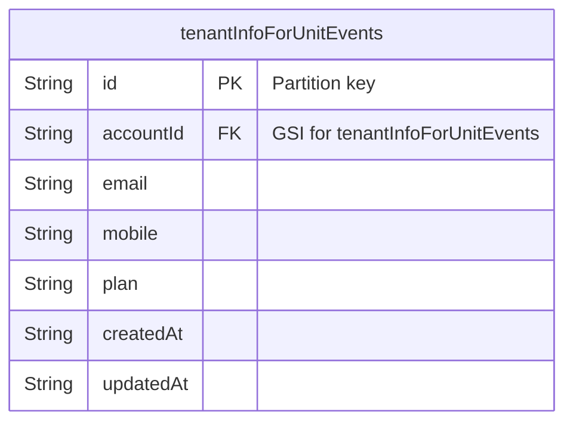
```mermaid
erDiagram
tenantInfoForUnitEvents {
    String id PK "Partition key"
    String accountId FK "GSI for tenantInfoForUnitEvents"
    String email
    String mobile
    String plan
    String createdAt
    String updatedAt
}
```

Access pattern `tenantInfoForUnitEvents`

| Table Name | Access Pattern |
| ---------- | -------------- |
| tenantInfoForUnitEvents |  getInfoByAccountId |

Global secondary indexes `tenantInfoForUnitEvents`

| Name | partition key | sortKey |
| ---------- | -------------- | ----------- |
| getInfoByAccountId | accountId (String) |  |

