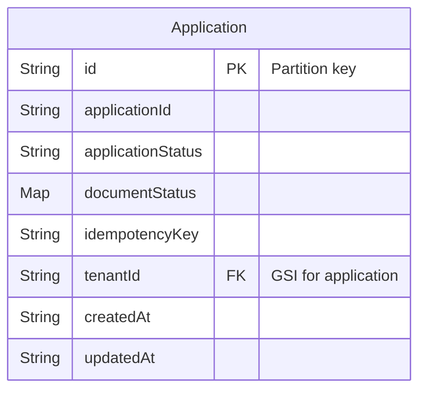
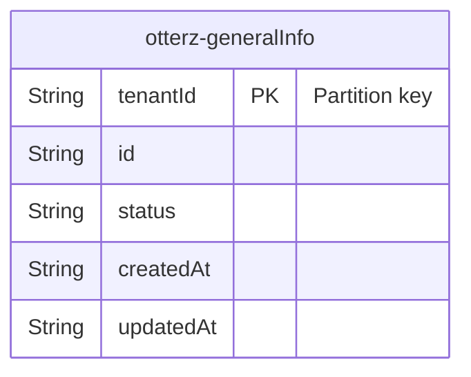
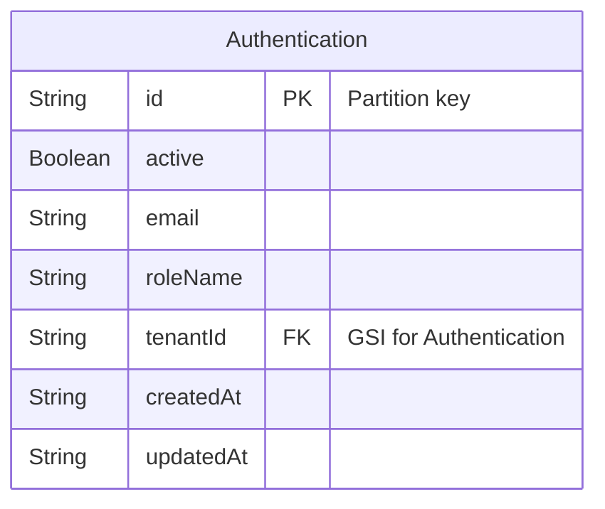

## Otterz Dtabase Structure

> As a database otterz using [DynamoDB](https://aws.amazon.com/dynamodb/)

### List of all the database using Otterz

- application
- master-settings-table
- otterz-cards
- otterz-generalInfo
- Authentication
- ExternalNotifications
- Rbac
- Tenant
- pa-settings
- payment-acceptance-onbarad-admin
- payment-acceptance-onboard
- payment
- product
- rewardsTable
- Subscription
- SubscriptionPlan
- SubscriptionUser
- tax
- temp__disable_nitificaitons
- tenantInfoForUnitEvents

## Database Structure

### **Application Table**

Structure of `Application` table.

Access pattern `Applicaiton`

| Table Name | Access Pattern |
| ---------- | -------------- |
| Application |  GetApplicationByTenantId | 

### **otterz-generalInfo Table**

Structure of `otterz-generalInfo` table.

### **Authentication Table**

Structure of `Authentication` table

Access pattern `Authentication`

| Table Name | Access Pattern |
| ---------- | -------------- |
| Authentication |  GetChildUsersByTenantId | 

